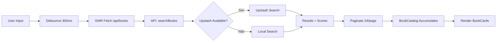

# Acervo Docente

[](https://nextjs.org/)
[](https://react.dev/)
[](https://www.typescriptlang.org/)
[](https://tailwindcss.com/)
[](https://upstash.com/)
[](https://vercel.com/)
[](LICENSE)

> **Catálogo de livros para apoio pedagógico** — Uma ferramenta para auxiliar professores com recomendações de livros e planos de aula.

## 📚 Visão Geral

O **Acervo Docente** é um catálogo web moderno construído para ajudar educadores a descobrir livros relevantes para sua prática pedagógica. O sistema oferece busca full-text, filtros por tópicos, paginação infinita e uma interface responsiva com suporte a modo escuro.

### ✨ Funcionalidades

- 🔍 **Busca híbrida** — Combina Upstash Search (BM25 + semântico) com fallback local
- 📖 **Catálogo expansível** — Cards de livro com resumo, tópicos e link para Google Drive
- ⚡ **Performance** — Debounce de 300ms, SWR com `keepPreviousData`, skeletons
- 🌙 **Dark mode automático** — Via CSS variables (OKLCH) + `prefers-color-scheme`
- ♿ **Acessibilidade** — Semântica HTML, ARIA labels, navegação por teclado
- 📱 **Responsivo** — Mobile-first, grid 2 colunas em desktop

## 🚀 Quick Start

### Pré-requisitos

- Node.js 20+
- pnpm 9+ (recomendado) ou npm/yarn
- Conta no [Upstash](https://console.upstash.com/) (para busca em produção)

### Instalação

```bash
# Clone o repositório
git clone https://github.com/seu-usuario/acervo-docente.git
cd acervo-docente

# Instale dependências
pnpm install

# Configure variáveis de ambiente
cp .env.example .env.local
# Edite .env.local com suas credenciais Upstash

# Rode em desenvolvimento
pnpm dev
```

Acesse: http://localhost:3000

### Popular índice de busca (produção)

```bash
# Requer UPSTASH_SEARCH_REST_TOKEN no .env.local
pnpm seed:search
```

## 🛠️ Scripts Disponíveis

| Comando | Descrição |
|---------|-----------|
| `pnpm dev` | Inicia servidor de desenvolvimento (Turbopack) |
| `pnpm build` | Build de produção |
| `pnpm start` | Inicia servidor de produção |
| `pnpm lint` | Executa ESLint |
| `pnpm seed:search` | Popula índice Upstash Search com dados de `data/books.json` |

## 📁 Estrutura do Projeto

```
acervo-docente/
├── app/
│   ├── api/books/route.ts      # API endpoint: GET /api/books?q=&page=
│   ├── globals.css             # Estilos globais (Tailwind v4 + CSS variables)
│   ├── layout.tsx              # Layout raiz (fonts, metadata, analytics)
│   └── page.tsx                # Página principal
├── components/
│   ├── ui/                     # Primitivas UI (shadcn/ui style)
│   │   ├── badge.tsx
│   │   ├── button.tsx
│   │   ├── dialog.tsx
│   │   └── skeleton.tsx
│   ├── book-card.tsx           # Card de livro (expansível, copy, link)
│   ├── book-catalog.tsx        # Catálogo com busca, paginação, skeletons
│   └── site-header.tsx         # Header com título e contador
├── data/
│   └── books.json              # Base de dados (~1.1MB, centenas de livros)
├── lib/
│   ├── books.ts                # Tipos, busca local, utilitários
│   ├── search.ts               # Cliente Upstash Search + hybrid search
│   └── utils.ts                # Utilitários (cn = clsx + tailwind-merge)
├── scripts/
│   └── seed-upstash-search.ts  # Script de seeding do índice
├── docs/                       # Documentação (Nextra)
└── config files...
```

## 🔧 Tecnologias

| Categoria | Tecnologias |
|-----------|-------------|
| **Framework** | Next.js 16 (App Router, RSC, Turbopack) |
| **React** | 19 (Client Components onde necessário) |
| **Styling** | Tailwind CSS v4 + `tw-animate-css` + `shadcn/ui` (base-nova) |
| **UI Primitives** | `@base-ui/react` (headless, acessível) |
| **Icons** | `lucide-react` |
| **Data Fetching** | `swr` (client) + `fetch` nativo (server) |
| **Fonts** | Geist Sans/Mono + Playfair Display (`next/font`) |
| **Analytics** | `@vercel/analytics` (apenas produção) |
| **Search** | Upstash Search (BM25 + vetorial) |
| **TypeScript** | 5.7 (strict mode) |

## 🔑 Variáveis de Ambiente

| Variável | Obrigatória | Descrição |
|----------|-------------|-----------|
| `UPSTASH_SEARCH_REST_URL` | Sim | URL do índice Upstash Search |
| `UPSTASH_SEARCH_REST_TOKEN` | Sim | Token admin (upsert, delete) |
| `UPSTASH_SEARCH_REST_READONLY_TOKEN` | Não | Token read-only (busca apenas) |
| `CONTEXT7_API_KEY` | Não | Para features de IA futuras |

Veja [`.env.example`](.env.example) para template completo.

## 📖 Documentação

- [Getting Started](docs/getting-started/installation.md)
- [Development Guide](docs/getting-started/development.md)
- [Deployment](docs/getting-started/deployment.md)
- [Adding Books](docs/guides/adding-books.md)
- [Seeding Upstash](docs/guides/seeding-upstash.md)
- [API Reference](docs/reference/api/books.md)
- [Architecture Overview](docs/architecture/overview.md)
- [ADRs](docs/architecture/adrs/)

## 🏗️ Arquitetura

### Fluxo de Dados



### Decisões Principais (ADRs)

- [ADR 001: Upstash Search + Local Fallback](docs/architecture/adrs/001-upstash-search.md)
- [ADR 002: JSON Estático vs Database](docs/architecture/adrs/002-json-data.md)
- [ADR 003: @base-ui/react vs Radix UI](docs/architecture/adrs/003-ui-library.md)
- [ADR 004: SWR vs TanStack Query](docs/architecture/adrs/004-data-fetching.md)

## 🎨 Tematização

O projeto usa **CSS Variables (OKLCH)** para tema light/dark automático. Variáveis principais em `app/globals.css`:

```css
:root {
  --background: oklch(0.985 0.005 95);
  --foreground: oklch(0.25 0.01 90);
  --primary: oklch(0.42 0.06 155);
  --radius: 0.625rem;  /* 10px base */
  /* ...mais variáveis */
}

.dark {
  --background: oklch(0.145 0 0);
  --foreground: oklch(0.985 0 0);
  /* ...overrides dark */
}
```

## ♿ Acessibilidade

- Semântica HTML5 (`<main>`, `<section>`, `<article>`, `<header>`)
- `aria-label` em botões de ação (copy, expand, link externo)
- Navegação por teclado completa
- Contraste WCAG AA (verificado via CSS variables)
- `prefers-reduced-motion` respeitado nas animações
- Screen reader friendly (textos descritivos)

## 🧪 Testes

> **Status:** Não implementado ainda — veja [roadmap](#-roadmap)

Planejado:
- Unit tests: Vitest + React Testing Library
- E2E: Playwright
- Visual regression: Chromatic/Storybook
- A11y: axe-core no CI

## 📦 Deploy

### Vercel (Recomendado)

1. Conecte o repositório na Vercel
2. Configure as Environment Variables:
   - `UPSTASH_SEARCH_REST_URL`
   - `UPSTASH_SEARCH_REST_TOKEN`
   - `UPSTASH_SEARCH_REST_READONLY_TOKEN`
3. Deploy automático a cada push na `main`

### Build Local

```bash
pnpm build
pnpm start
```

## 🤝 Contribuindo

Leia nosso [Guia de Contribuição](CONTRIBUTING.md) para:
- Code style (ESLint + Prettier + TypeScript strict)
- Convenção de commits (Conventional Commits)
- Processo de Pull Request
- Como rodar testes e lint localmente

## 🔒 Segurança

Veja [SECURITY.md](SECURITY.md) para reportar vulnerabilidades.

## 📄 Licença

MIT License — veja [LICENSE](LICENSE) para detalhes.

## 🙏 Agradecimentos

- [Upstash](https://upstash.com/) pela busca serverless
- [Vercel](https://vercel.com/) pela plataforma de deploy
- [shadcn/ui](https://ui.shadcn.com/) pelos padrões de componentes
- [Base UI](https://base-ui.com/) pelas primitivas headless
- [Lucide](https://lucide.dev/) pelos ícones

---

**Feito com ❤️ para educadores brasileiros**